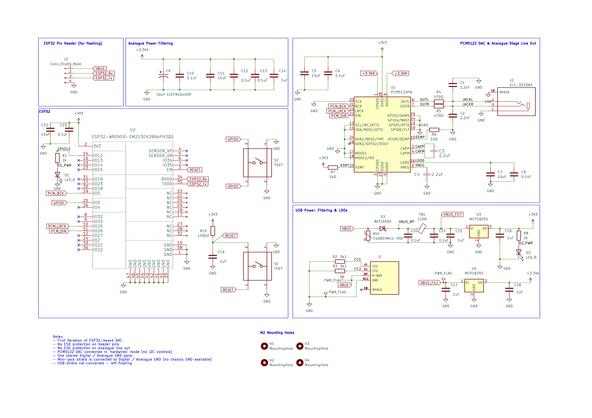
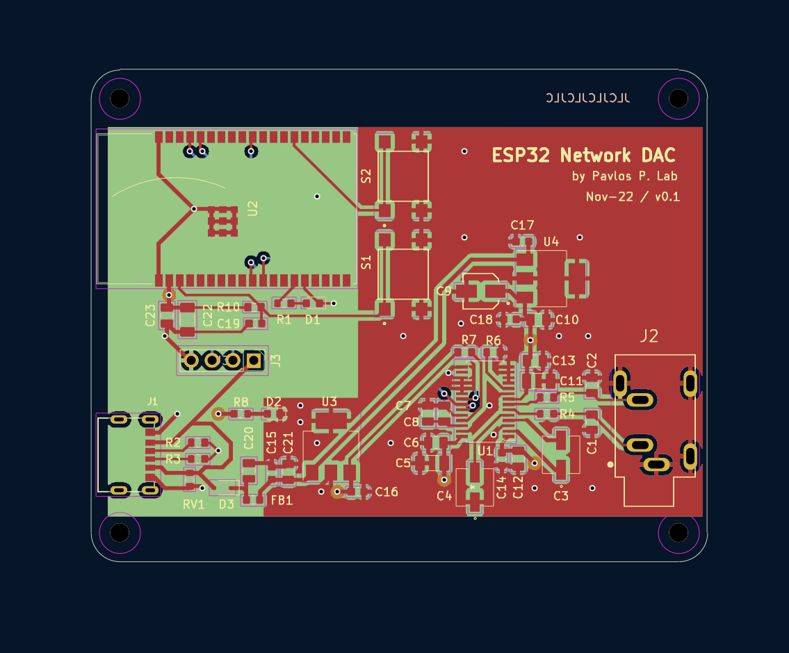

# ESP32-based network streamer and DAC

## Description

This is my first attempt at a simple, high-quality Digital to Analog Converter (DAC) and network streamer. Design is based around the ESP32 WiFi microcontroller, with a Texas Instruments PCM5122 high-quality DAC.

Schematic and PCB layout designed on KiCad 6.

## Schematic and PCB

Manufacturing files are included for the first iteration of the circuit board.

## Next steps

Refine component selection to simpler components for easier assembly (C0G capacitors).

Longer-term plan: Build on this design to build digital mixer and USB audio interface (potentially with different microcontroller from STM32 range)

## Acknowledgements

Thanks to all the online resources and reference DAC implementations (on TI data sheets). The design can be further improved of course - any suggestions, do let me know.

Many thanks to the [squeezelite-esp32](https://github.com/sle118/squeezelite-esp32) project for the software stack, which includes AirPlay and works with some configuration changes - I2S pinout configuration for digital audio data and clock signals.
